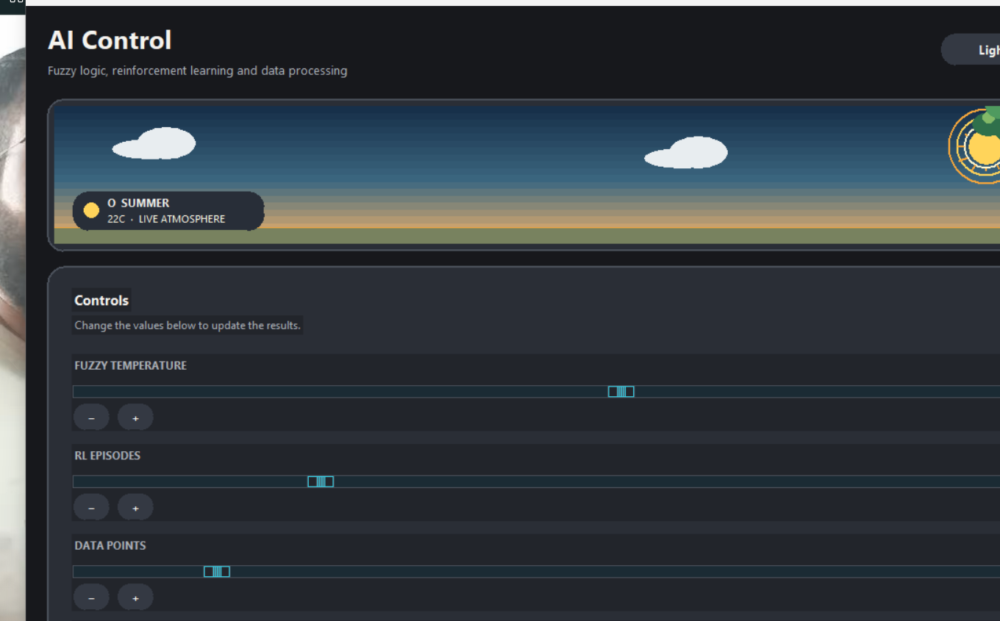
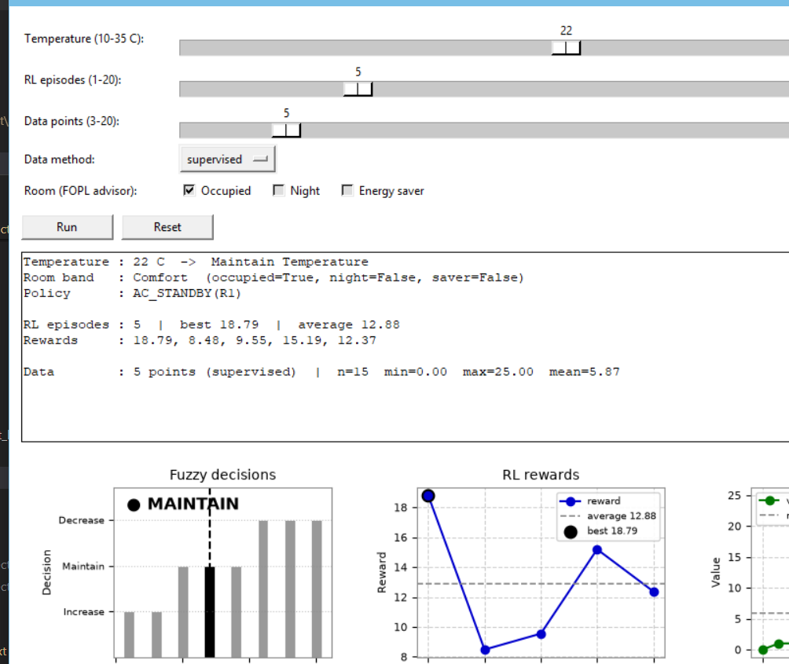

# AI Systems Project


A Python educational AI project that demonstrates four approaches:

- **Fuzzy logic** for temperature control
- **First-Order Predicate Logic (FOPL)** for a smart-room advisor
- **Q-learning-style reinforcement learning** in a small discrete environment
- **Data generation and processing** for supervised and unsupervised examples

The project includes a Tkinter/Matplotlib desktop GUI, a console mode, experiments, and automated tests.

## Features

### Fuzzy Logic
The temperature controller uses bounded membership functions for:

- Cold
- Comfortable
- Hot

It converts the strongest membership into an action:

| Temperature condition | Action |
|---|---|
| Cold | Increase Temperature |
| Comfortable | Maintain Temperature |
| Hot | Decrease Temperature |

### FOPL Smart-Room Advisor
The `src/fopl/` package contains a small forward-chaining knowledge base. It combines temperature bands with occupancy, night, and energy-saver facts to derive room-control actions and an explanation trace.

### Reinforcement Learning
The RL module contains:

- `RLAgent` — Q-table based agent
- `RLEnvironment` — discrete environment with a goal state
- `RLTrainer` — training and evaluation

Training rewards are retained so the GUI can plot them.

### Data-Driven Pipeline
The project includes deterministic supervised and unsupervised sample generation, cleaning, transformation, and JSON save/load support.

## Project Structure

```text
AI-Systems-Project/
├── assets/                 # Application assets
├── data/                   # Small checked-in sample data
├── docs/                   # Project documentation
├── experiments/            # Experiment notes
├── notebooks/              # Jupyter experiments
├── scripts/                # Optional shell launchers
├── src/
│   ├── common/
│   ├── data_driven/
│   ├── fopl/
│   ├── fuzzy_logic/
│   ├── reinforcement_learning/
│   └── main.py
├── tests/
├── requirements.txt
├── run_gui.py
├── run_gui.bat
├── run_gui.ps1
├── run_basic.py
├── run_basic.bat
├── run_basic.ps1
├── setup.py
└── README.md
```

## Requirements

- Python 3.11+
- Tkinter for the desktop GUI
- Dependencies listed in `requirements.txt`

## Run

Clone the repository, then:

```bash
python -m pip install -r requirements.txt
python run_gui.py
```

For console mode:

```bash
python run_gui.py --console
```

You can also run:

```bash
python src/main.py --console
```

There are two interfaces. The full GUI (`python run_gui.py`) has dark/light
themes, one-row chart outputs with value legends, Cold/Normal/Hot presets that
reconfigure temperature plus RL episodes plus data points, a Logic Advisor
section with room tick-boxes, an 11-LED FOPL policy row with switches, a live
weather sky, and an Export button that zips charts plus summary plus logic
trace. The basic GUI (`python run_basic.py`) is a plain white window with the
same engine: sliders, three charts with best/average/mean guides, a text
readout, advisor tick-boxes, and the LED row — no animations.




The main app is at v2.0 and the basic app at v1.0 (shown in their window
title bars, mirrored in `setup.py` and `src/version.py`). For the viva walkthrough see [docs/VIVA_DEMO.md](docs/VIVA_DEMO.md).

The GUI lets you adjust temperature, RL episode count, data-point count, and the data-generation method. The Export button saves charts, a text summary, and the logic trace into the local `outputs/` directory.

## Testing

Run all tests with:

```bash
pytest
```

The tests cover fuzzy decisions and memberships, reinforcement-learning behavior, data generation/pipeline behavior, FOPL behavior, and visual-output generation.


## GUI Preview & AI Flow

The desktop interface uses a rounded cyan-monochrome design with dark/light themes, animated weather visuals, live module indicators, and FOPL policy LEDs.

The main interaction flow is:

```text
Temperature
    ↓
Fuzzy Logic
    ↓
FOPL Room Policy
    ↓
Reinforcement Learning
    ↓
Data Pipeline
    ↓
Integrated Result
```

### Interactive features

- **Auto Mode** — temperature changes trigger a short debounce and then refresh the full AI pipeline.
- **FOPL policy LEDs** — eleven action lights with room switches, so every policy output can be demonstrated live.
- **Module status indicators** — live status for Fuzzy, FOPL, RL, and Data modules.
- **RL statistics** — episode count, best reward, average reward, and latest reward.
- **Export Report** — packages charts, summary information, and FOPL inference into a ZIP file.
- **GUI smoke test** — the CI pipeline launches the Tkinter interface under Xvfb and checks construction plus theme switching.

## Windows Executable

Two launchers ship in `dist/` (built locally, never committed):

- `AISystemsProject.exe` — the full GUI (themes, animations, LEDs, export).
- `AISystemsProjectBasic.exe` — the plain white GUI (same engine, no animations).

The repository includes an application icon and Windows launcher scripts (`run_gui.bat/.ps1`, `run_basic.bat/.ps1`). If you want to redistribute, rebuild locally with PyInstaller rather than committing the generated `build/` or `dist/` directories.

## Notes

This is an educational project rather than a production HVAC controller. The fuzzy and reinforcement-learning components are intentionally small so their algorithms can be inspected and studied easily.

Generated runtime output is ignored by Git. Keep credentials, API keys, and machine-specific configuration outside the repository.

## License

This project is licensed under the MIT License. See [LICENSE](LICENSE).


## 🌐 Links

**Portfolio:** https://ragibashhab.netlify.app/

**GitHub:** https://github.com/TheKIAR

**LinkedIn:** https://www.linkedin.com/in/md-ragib-ashhab-768a19240/

**Linktree:** https://linktr.ee/RagibAshhab
