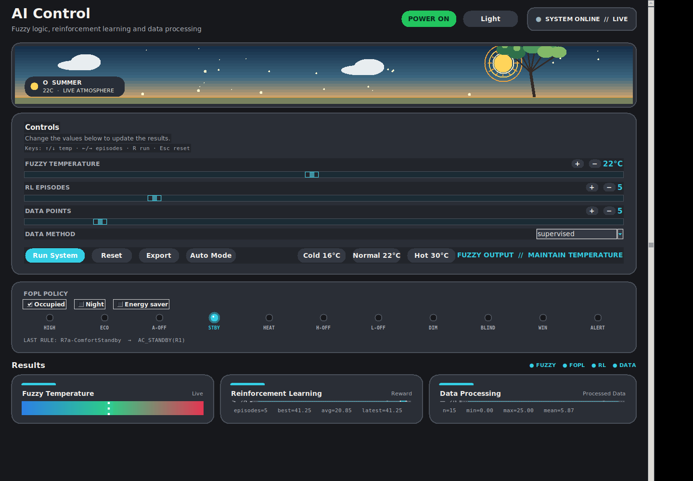
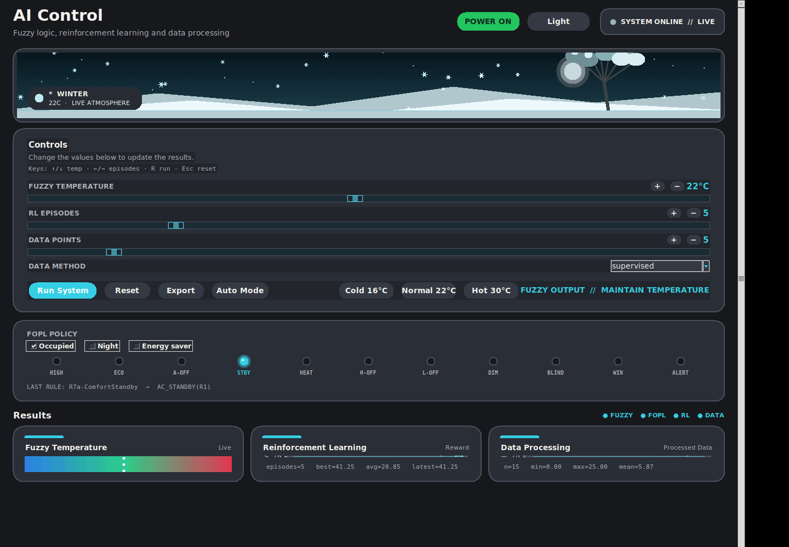
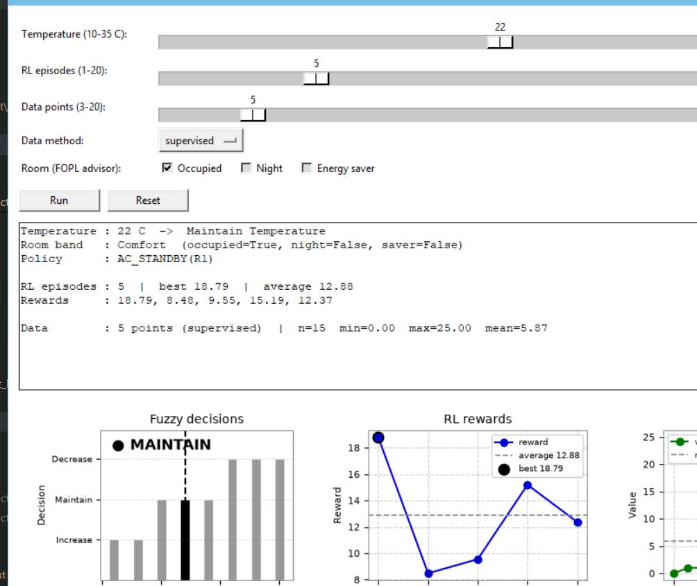

# 🤖 AI Control Systems Lab

<p align="center">
  
</p>

<p align="center">
  <strong>Fuzzy Logic • Predicate Logic • Reinforcement Learning • Data Processing</strong><br>
  An approachable educational AI playground for experimenting with intelligent room-control systems.
</p>

<p align="center">
  <a href="https://github.com/TheKIAR/AC-Control-AI-Systems-Project/actions/workflows/tests.yml"></a>
  <a href="https://github.com/TheKIAR/AC-Control-AI-Systems-Project"></a>
  
  
</p>

---

## 🌟 What is this?

This project brings several AI techniques together in one interactive desktop application. Instead of treating each algorithm as a disconnected assignment, it lets you **see how different reasoning and learning approaches can work together**.

### 🧩 The AI stack

| Module | What it demonstrates |
|---|---|
| 🌡️ **Fuzzy Logic** | Cold / Comfortable / Hot temperature reasoning |
| 🧠 **FOPL** | Rule-based smart-room reasoning with explanation traces |
| 🎯 **Reinforcement Learning** | Q-table learning in a small discrete environment |
| 📊 **Data Pipeline** | Deterministic supervised & unsupervised sample generation |
| 🖥️ **Interactive GUI** | Live controls, charts, themes, indicators and export |

## 🖼️ See it in action

<p align="center">
  
</p>

<p align="center">
  
</p>

A classic, minimal GUI is included too:

<p align="center">
  
</p>

## 🔬 How the system flows

```text
Temperature
     ↓
Fuzzy Logic
     ↓
FOPL Room Policy
     ↓
Reinforcement Learning
     ↓
Data Pipeline
     ↓
Integrated Result
```

### Interactive features

- ⚡ **Auto Mode** — refreshes the AI pipeline after temperature changes
- 💡 **FOPL policy LEDs** — eleven live action indicators with room switches
- 📡 **Module status** — Fuzzy, FOPL, RL and Data status at a glance
- 📈 **RL statistics** — episodes, best reward, average reward and latest reward
- 📦 **Export Report** — packages charts, summary information and logic traces
- 🌗 **Dark / Light themes**
- 🌤️ **Animated weather visuals**
- 🧪 **GUI smoke testing** under Xvfb

## 🧪 Run it locally

**Requirements:** Python 3.11+, Tkinter, and the packages in `requirements.txt`.

```bash
python -m pip install -r requirements.txt
python run_gui.py
```

Console mode:

```bash
python run_gui.py --console
# or
python src/main.py --console
```

Run the test suite:

```bash
pytest
```

## 🗂️ Project structure

```text
assets/                    # Screenshots and demo media
data/                      # Sample data
docs/                      # Documentation
experiments/               # Experiment notes
notebooks/                 # Jupyter experiments
scripts/                   # Optional launchers
src/
├── common/
├── data_driven/
├── fopl/
├── fuzzy_logic/
├── reinforcement_learning/
└── main.py
tests/
```

## 🧠 Why I built it

This is an educational project, not a production HVAC controller. The algorithms are intentionally compact and inspectable so the ideas behind **reasoning, learning and data processing** remain easy to explore.

## 🚀 Future direction

- More realistic control environments
- Richer reinforcement-learning experiments
- More explainable AI traces
- Additional data-generation scenarios
- Expanded visualization and reporting

## 👋 Connect

Built by **Md. Ragib Ashhab**.

🌐 [Portfolio](https://ragibashhab.netlify.app/) · 💼 [LinkedIn](https://www.linkedin.com/in/md-ragib-ashhab-768a19240/) · 🔗 [Linktree](https://linktr.ee/RagibAshhab) · 🐙 [GitHub](https://github.com/TheKIAR)

---

> **Build it. Understand it. Test it. Make it useful.**
